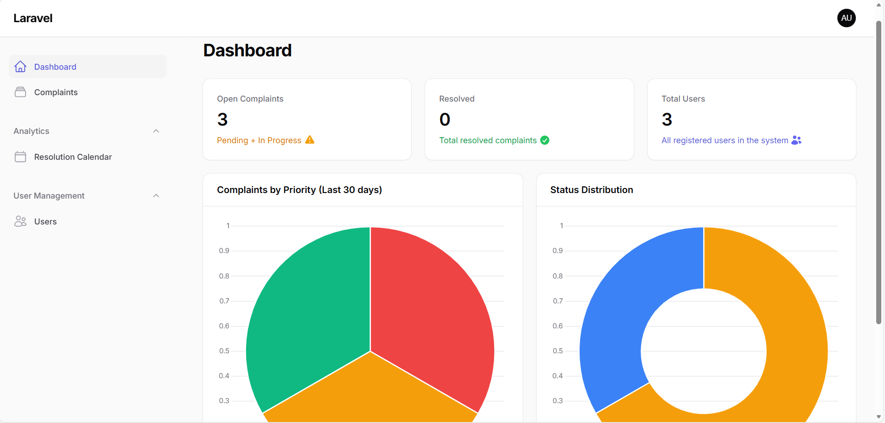
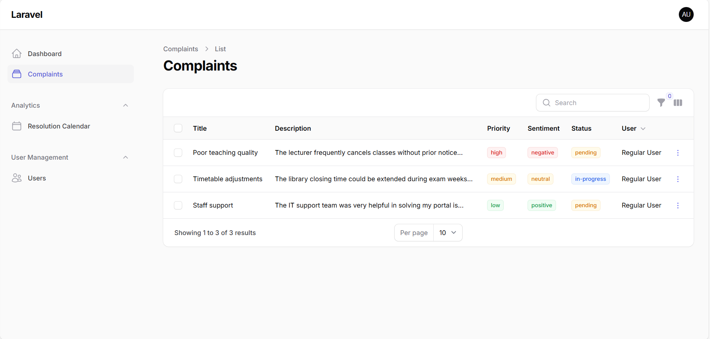

# 🛠 Complaint Management System

A web-based Complaint Management System built using Laravel with AI integration for complaint classification and role-based access control.

---

## 🚀 Tech Stack
- Laravel
- PHP
- MySQL
- Tailwind CSS
- Python (AI Model)

---

## 👥 User Roles
- Admin
- Staff
- User

---

## ✨ Features
- User Authentication
- Role-Based Access Control
- Complaint Submission & Tracking
- AI Complaint Categorization
- Dashboard with Analytics
- Status Management (Pending / In Progress / Resolved)

---

## 🧠 AI Module
The system integrates a Python-based AI model (`ai_model.py`) to classify complaints automatically.

---

## ⚙️ Installation Guide

1. Clone the repository
2. Run:
   composer install
3. Copy .env.example to .env
4. Configure database
5. Run:
   php artisan migrate
6. Start server:
   php artisan serve

---
## 📸 Screenshots

### 🔐 Login Page

### 📊 Dashboard

### 📝 Complaint Form

### 📈 Complaint List

---

## 👩‍💻 Developed By
Fathima Mifra
